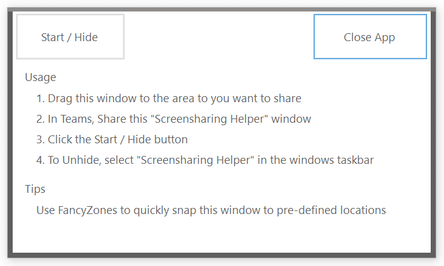

# Screenshare Helper



Screenshare Helper is a small tool to allow sharing of a portion of your screen in Microsoft Teams (and possibly other meeting apps, but that's untested). This is particularly beneficial for people with 4K monitors. When sharing the screen people with smaller displays can't read anything because it scaled down too small.

5 minute demo video https://www.youtube.com/watch?v=R-kB7jNtoSA

## Prerequisites
This tool is built on .net 5 windows forms. You may need to install the [.net 5 runtime](https://dotnet.microsoft.com/download/dotnet/5.0).

## Download

A zip of the latest master branch is automatically built and can be downloaded from the [latest release](releases/latest) page.

## How to use the tool?
1. Start ScreenshareHelper.exe
    > Suggestion: pin the application to the taskbar to make it quickly accessible.

2. Move and resize the window to the area you want to share.
    > You can move the window by clicking and dragging anywhere on the background of the window.

3. In Teams, share the "Screenshare Helper" window.

4. Click the "Start / Hide" button.
    >This will hide the window. To make the window visible again, task switch to it, eg. click the Screensharing Helper app in the windows taskar.

Tip
> Use [FancyZones](https://docs.microsoft.com/en-us/windows/powertoys/fancyzones) from [Microsoft's PowerToys](https://docs.microsoft.com/en-us/windows/powertoys/fancyzones) to snap the window and content to a pre-defined area.


## Command Line Options / SnapToProcess
You can create a .bat file or use a desktop shortcut to add command line options to let the tool snap to a certain process on startup.
Use process name or better process ID (MainWindow process ID) to accomplish this.

-n => Process name (e.g. firefox)
-i => PID

Examples
```
ScreenshareHelper.exe -n notepad2
ScreenshareHelper.exe -i 12345
```

# michiproep/ScreenshareHelper
This is a fork of the [michiproep/ScreenshareHelper](https://github.com/michiproep/ScreenshareHelper) project.
